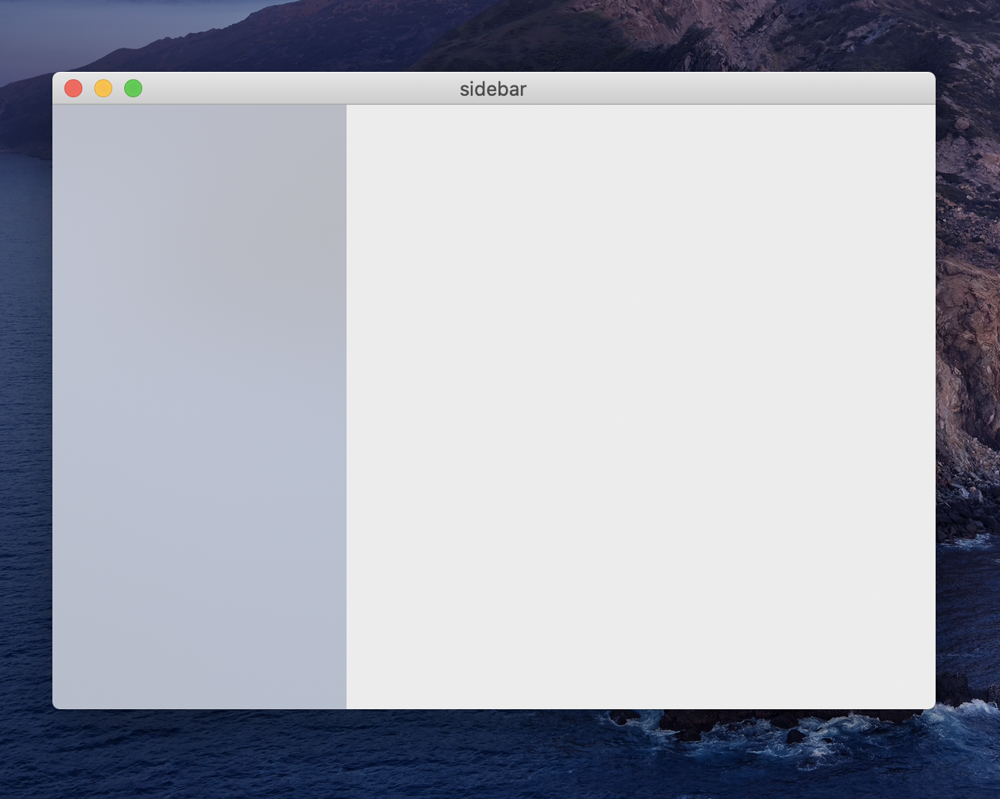

# React Native for MacOS: Translucent Sidebar Example

To run:

- Open macos/sidebar.xcworkspace in Xcode or run "xed -b macos"
- yarn start:macos
- Hit the Run button

Links:
- [Blog post](https://dev.to/edvinasbartkus/translucent-sidebar-with-react-native-for-macos-2l5i)